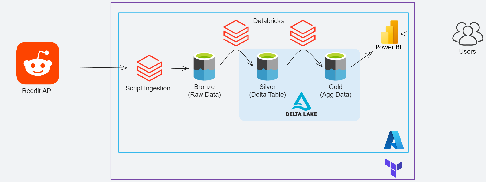

# Azure Delta Lake

This is a personal project that aims to provision a Delta Lake infrastructure using Terraform on the Azure Cloud.

PS: This project used the Azure Free Tier plan. Deploying it without the free tier will cost you money!

## Index

- [1. Objectives](#1-objectives)
- [2. Architecture](#2-architecture)
- [3. Steps](#3-steps)
- [4. What could be improved?](#4-what-could-be-improved)
- [5. Sources](#5-sources)

## 1. Objectives
Creation of the infrastructure of a data lake in the Azure cloud by provisioning resources with Terraform IaC.

Ingest Reddit topics data via API, ETL it into subsequent layers and then expose it to BI and/or Data Viz tools.

## 2. Architecture



## 3. Steps

### 3.1 Terraform and Azure CLI
Install Terraform on the preferred OS following the instructions in this [documentation](https://developer.hashicorp.com/terraform/tutorials/aws-get-started/install-cli).

Install Azure CLI on the preferred OS following the instructions in this [documentation](https://learn.microsoft.com/en-us/cli/azure/install-azure-cli).

An [Azure account](https://azure.microsoft.com/en-gb/free/search/) with credentials that allow the creation of resources is needed.

Once everything is installed, run the command `az login` and authorize with the Azure account on the browser.

### 3.2 Creating Reddit App
Create a [Reddit app](https://www.reddit.com/prefs/apps).

Give it a name, select the **script** option and fill in the desired redirect uri(such as http://localhost:8000).

Once it's created, copy the client_id (the one below the name of your app) and the secret. These credentials will be necessary for the deployment process.

### 3.3 Deploying
Inside the terraform folder, run `terraform init` to initialize the directory and ready it for deployment.

Change the information inside **variables.tf** to reflect your Azure account and REddit App. Both the subscription_id and tenant_id can be retrieved by running the command `az account list` on the terminal.

Now run `terraform apply --auto-approve` to create the infrastructure automatically on Azure, it will take some minutes (make sure you have permission to create resources on Azure!).

Terraform will give you an error saying that it cannot create the Databricks cluster and components. This is normal. Open the Azure console, launch the Databricks Workspace that was created and authenticate on the browser. \
Then go back to the terminal and run `terraform apply --auto-approve` again. That will create all the remaining Databricks resources.

### 3.4 Running the pipeline
A pipeline was created and scheduled using the Databricks Workflow. Trying to run it right away will give an Error. This is a bug. It will not authenticate the cluster until you enter the Compute menu and click on the cluster name.

This pipeline is composed of 4 notebooks:
1. Configure the Delta Lake schemas
2. Ingest Reddit raw data to the Bronze Layer
3. ETL the data to the Silver Layer as a Delta Table
4. Run a simple algorithm to calculate which post is trending and save it into the Gold Layer

### 3.5 Query the data
After the pipeline runs, the data is now accessible as a Delta Table. \
There are many ways to access it, in this doc, we are going to use PowerBI.

Databricks have a direct connection with PowerBI. To access it, first, you need to create an access token. \
Go to User Settings -> Access tokens and Generate New Token. This access token is used to connect with the BI tool. 

Now follow [this documentation](https://learn.microsoft.com/en-gb/azure/databricks/partners/bi/power-bi) to connect with PowerBI using Partner Connect. 

### 3.6 Finishing
After all the tests are done, go to the terminal, cd into the terraform folder and run `terraform destroy --auto-approve` on the terminal to destroy all the infrastructure on AWS.

## 4. What could be improved?
Below are some ideas for improving the project.
- Partitioning the data on the containers. For example, in the Reddit data, the pathing would be something like this: 
```/silver/subreddit/post_creation_date/part0001-random-string.parquet```.

- Partition pruning on the ETL notebooks on Databricks to make the MERGE faster (without it Spark would scan the entire storage for each line it would update).

- Modular-ize terraform resources to pack resource configurations together and fix the error from the Databricks deployment.


## 5. Sources
1. [Big Data Architecture on Azure](https://learn.microsoft.com/en-us/azure/architecture/solution-ideas/articles/azure-databricks-modern-analytics-architecture)

2. [Production-ize Databricks Notebooks](https://www.databricks.com/blog/2022/06/25/software-engineering-best-practices-with-databricks-notebooks.html)

3. [Data Integration with Databricks](https://medium.com/creative-data/data-integration-with-azure-databricks-f9ab3bb07dc)

4. [Connect to Storage Account from Databricks](https://docs.databricks.com/storage/azure-storage.html#language-Account%C2%A0key)

5. [CI/CD with Terraform](https://quileswest.medium.com/deploying-terraform-infrastructure-with-ci-cd-pipeline-34d5bb51689d)